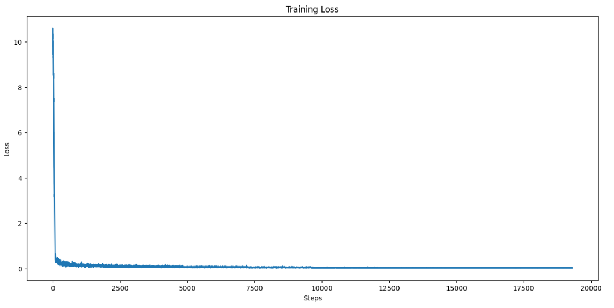

# GPT-2..., can Query?

## Fine-tuning GPT-2 to convert natural language questions into SQL queries

## Initial Inference
**Load an instance of GPT-2 and use it for inference:**
```python
from transformers import GPT2LMHeadModel, GPT2Tokenizer
import torch

# Step 1: Load the GPT-2 model and tokenizer
model_name = "gpt2-medium"
model = GPT2LMHeadModel.from_pretrained(model_name)
tokenizer = GPT2Tokenizer.from_pretrained(model_name)

prompts = ["What is the population of France?",
           "What was the per-year population of Italy for each year until now?",
           "Which is the best food in this restaurant?",
           "How many subjects does the school teach?",
           "Find the names of the students and the number of modules they are currently enrolled in.",
           "How many bicycles were sold between the dates 2023-01-01 and 2023-04-01?"           
          ]

def generate_sql(prompt):
    
    """ Generate output using the model """
    input_ids = tokenizer.encode(prompt, return_tensors="pt")

    with torch.no_grad():
        output = model.generate(
            input_ids,
            max_length=100,  
            num_return_sequences=1, 
            top_k=50,  
            pad_token_id=tokenizer.eos_token_id,
            do_sample=False  
        )

    return tokenizer.decode(output[0], skip_special_tokens=True)

for prompt in prompts:
    q = generate_sql(prompt)
    print("Generated Query:")
    print(q + "\n")
```

```
Question: What is the population of France?
Generated Query:
The population of France is about 1.2 million.

Question: What was the per-year population of Italy for each year until now?
Generated Query:
The population of Italy for each year since the year 2000 was estimated by the Italian Statistical Institute (ISI) using
the population of Italy as the reference. The population of Italy for each year since 2000 was estimated by the Italian
Statistical Institute (ISI) using the population of Italy as the reference.

Question: How many subjects does the school teach?
Generated Query:
The school teaches about 200 subjects, including English, history, geography, history of science, history of medicine,
history of technology, history of technology, history of science, history of technology, history of science,
history of science, history of science, history of science, history of science, history of science.

Question: Find the names of the students and the number of modules they are currently enrolled in.
Generated Query:
If you are unsure of the number of students enrolled in a module, you can check the number of students enrolled in a
module by clicking on the student's name.

Question: How many bicycles were sold between the dates 2023-01-01 and 2023-04-01?
Generated Query:
The number of bicycles sold between the dates 2023-01-01 and 2023-04-01 is unknown.

As it can be seen, the initial model generates inaccurate and irrelevant responses to the questions,
often hallucinating random facts.
```

## Data: Spider - Human-Labeled Dataset for Complex and Cross-Domain Semantic Parsing and Text-to-SQL Tasks
Spider is a complex and cross-domain semantic parsing and text-to-SQL dataset annotated by 11 college students. It consists of 10,181 questions and 5,693 unique complex SQL queries on 200 databases with multiple tables, covering 138 different domains.
https://arxiv.org/abs/1809.08887
```python
from torch.utils.data import Dataset, DataLoader
from collections import defaultdict
import json

class Loader:
    def __init__(self):
        self.data = defaultdict(str)

    def load_data(self, path):  
        with open(path, "r") as file:
            data = json.load(file)

            for ls in data:
                self.data[ls["question"].strip()] = ls["query"]


class Text2SQL(Dataset):
    def __init__(self, data, tokenizer, max_length=512):
        self.data = data
        self.tokenizer = tokenizer
        self.max_length = max_length

    def __len__(self):
        return len(self.data)

    def __getitem__(self, idx):
        question, sql_query = list(self.data.items())[idx]
        text = question + "\n" + sql_query
        encoding = self.tokenizer(text, truncation=True,
                                    padding="max_length",
                                    max_length=self.max_length,
                                    return_tensors="pt")
        
        input_ids = encoding["input_ids"].squeeze()
        attention_mask = encoding["attention_mask"].squeeze()
        return {"input_ids": input_ids,
                "attention_mask": attention_mask,
                "labels": input_ids}
```
## Resources
```python
+-----------------------------------------------------------------------------------------+
| NVIDIA-SMI 560.35.03              Driver Version: 560.35.03      CUDA Version: 12.6     |
|-----------------------------------------+------------------------+----------------------+
| GPU  Name                 Persistence-M | Bus-Id          Disp.A | Volatile Uncorr. ECC |
| Fan  Temp   Perf          Pwr:Usage/Cap |           Memory-Usage | GPU-Util  Compute M. |
|                                         |                        |               MIG M. |
|=========================================+========================+======================|
|   0  Tesla P100-PCIE-16GB           Off |   00000000:00:04.0 Off |                    0 |
| N/A   36C    P0             31W /  250W |   11311MiB /  16384MiB |      0%      Default |
|                                         |                        |                  N/A |
+-----------------------------------------+------------------------+----------------------+
                                                                                         
+-----------------------------------------------------------------------------------------+
| Processes:                                                                              |
|  GPU   GI   CI        PID   Type   Process name                              GPU Memory |
|        ID   ID                                                               Usage      |
|=========================================================================================|
+-----------------------------------------------------------------------------------------+
```

## Training 
```python
import torch
import matplotlib.pyplot as plt
from transformers import GPT2LMHeadModel, GPT2Tokenizer, AdamW, get_scheduler
from torch.optim import Adam
from tqdm import tqdm
from torch.amp import GradScaler, autocast

scaler = torch.amp.GradScaler()
model_name = "gpt2-medium"
model = GPT2LMHeadModel.from_pretrained(model_name)
tokenizer = GPT2Tokenizer.from_pretrained(model_name)
tokenizer.pad_token = tokenizer.eos_token

files = ["train_spider.json","/dev.json","train_others.json"]

loader = Loader()
for file in files:
    loader.load_data(path)
data = loader.data

dataset = Text2SQL(data, tokenizer)
dataloader = DataLoader(
        dataset,
        batch_size=4,
        shuffle=True
)

epochs = 5
optimizer = AdamW(model.parameters(), lr=1e-4)
warmup_steps = int(0.1 * len(dataloader) * epochs)  # Warm-up for 10% of steps
scheduler = get_scheduler(
    "linear",
    optimizer,
    num_warmup_steps=warmup_steps,
     num_training_steps=len(dataloader) * epochs
)


device = torch.device("cuda" if torch.cuda.is_available() else "cpu")
model.to(device)
training_lost = [] 

model.train()
for epoch in range(epochs):
    epoch_loss = 0
    step_losses = []  
    batches = tqdm(dataloader, desc=f"Epoch {epoch + 1}/{epochs}")
    
    for step, batch in enumerate(batches):
        input_ids = batch["input_ids"].to(device)
        attention_mask = batch["attention_mask"].to(device)
        labels = batch["labels"].to(device)

        optimizer.zero_grad()
        with autocast("cuda"):
            outputs = model(input_ids=input_ids,
                            attention_mask=attention_mask,
                            labels=labels)
            loss = outputs.loss

        scaler.scale(loss).backward()
        scaler.step(optimizer)
        scaler.update()
        scheduler.step()

        epoch_loss += loss.item()
        step_losses.append(loss.item())
        batches.set_postfix(loss=loss.item())

        training_loss.append(loss.item())
    
    print(f"Epoch {epoch + 1} Loss: {epoch_loss / len(dataloader)}")


plt.plot(train_loss_history)
plt.xlabel("Steps")
plt.ylabel("Loss")
plt.title("Training Loss")
plt.show()
print("Loss plot saved as 'training_loss_plot.png'")


model.save_pretrained("./fine_tuned_sql_model")
tokenizer.save_pretrained("./fine_tuned_sql_model")
```

Epoch 1/8: 100%|██████████| 2413/2413 [38:12<00:00,  1.05it/s, loss=0.0587]

Epoch 1 Loss: 0.34228656870470076

Epoch 2/8: 100%|██████████| 2413/2413 [38:11<00:00,  1.05it/s, loss=0.131] 

Epoch 2 Loss: 0.07904404143108479

Epoch 3/8: 100%|██████████| 2413/2413 [38:10<00:00,  1.05it/s, loss=0.0454]

Epoch 3 Loss: 0.05845054243588986

Epoch 4/8: 100%|██████████| 2413/2413 [38:13<00:00,  1.05it/s, loss=0.0137]

Epoch 4 Loss: 0.045304339237424704

Epoch 5/8: 100%|██████████| 2413/2413 [38:17<00:00,  1.05it/s, loss=0.0373]

Epoch 5 Loss: 0.03585842312450632

Epoch 6/8: 100%|██████████| 2413/2413 [38:17<00:00,  1.05it/s, loss=0.0228]

Epoch 6 Loss: 0.028979423863082273

Epoch 7/8: 100%|██████████| 2413/2413 [38:16<00:00,  1.05it/s, loss=0.0281]

Epoch 7 Loss: 0.024208021516939862

Epoch 8/8: 100%|██████████| 2413/2413 [38:17<00:00,  1.05it/s, loss=0.0211]

Epoch 8 Loss: 0.02085933081035329

<p align="center">
    
</p>


## Inference with the fine-tuned model:
```python 
model_path = "./fine_tuned_sql_model" 
model = GPT2LMHeadModel.from_pretrained(model_path)
tokenizer = GPT2Tokenizer.from_pretrained(model_path)

tokenizer.pad_token = tokenizer.eos_token

device = torch.device("cuda" if torch.cuda.is_available() else "cpu")
model = model.to(device)
model.eval()

prompts = [
            "What is the population of France?",
            "What was the per-year population of Italy for each year until now?",
            "Which is the best food in this restaurant?",
            "How many subjects does the school teach?",
            "Find the names of the students and the number of modules they are currently enrolled in.",
            "How many bicycles were sold between the dates 2023-01-01 and 2023-04-01?"           
    ]

def generate_sql(prompt):
    
    """ Generate output using the model """
    input_ids = tokenizer.encode(prompt, return_tensors="pt").to(device)

    with torch.no_grad():
        output = model.generate(
            input_ids,
            max_length=100,  
            num_return_sequences=1, 
            top_k=50,  
            pad_token_id=tokenizer.eos_token_id,
            do_sample=False  
        )

    return tokenizer.decode(output[0], skip_special_tokens=True)

for prompt in prompts:
    q = generate_sql(prompt)
    print("Generated Query:")
    print(q + "\n")
```

```
Question: What is the population of France?
Generated Query:
SELECT Population FROM country WHERE Name  =  "France"

Question: What was the per-year population of Italy for each year until now?
Generated Query:
SELECT Population ,  YEAR FROM country WHERE Name  =  "Italy"

Question: Which is the best food in this restaurant?
Generated Query:
SELECT Rating ,  Name FROM Restaurant ORDER BY Rating DESC LIMIT 1

Question: How many subjects does the school teach?
Generated Query:
SELECT count(DISTINCT subject_id) FROM SUBJECTS

Question: Find the names of the students and the number of modules they are currently enrolled in!
Generated Query:
SELECT T1.student_name ,  count(*) FROM Student_Course_Enrolment AS T1 JOIN Students AS T2 ON T1.student_id  =  T2.student_id GROUP BY T1.student_id

Question: How many bicycles were sold between the dates 2023-01-01 and 2023-04-01?
Generated Query:
SELECT count(*) FROM status WHERE date_of_sale BETWEEN '2023-01-01' AND '2023-04-01'
```
## Remarks and Potential Enhancements
The results are not perfect but highlight the potential of LLMs, specifically in how they can adapt to new domains with limited resources and data. Assuming all things being equal in terms of computational resources, here are some potential improvements:
- Hyperparameter tuning
- Increase the size of the dataset
- Apply gradient penalty for improved stability
- Experiment with more state-of-the-art models
- Implement early stopping
- Fine-tune on a more diverse set of SQL queries to improve generalization

These steps can help achieve better performance and more accurate SQL query generation.
